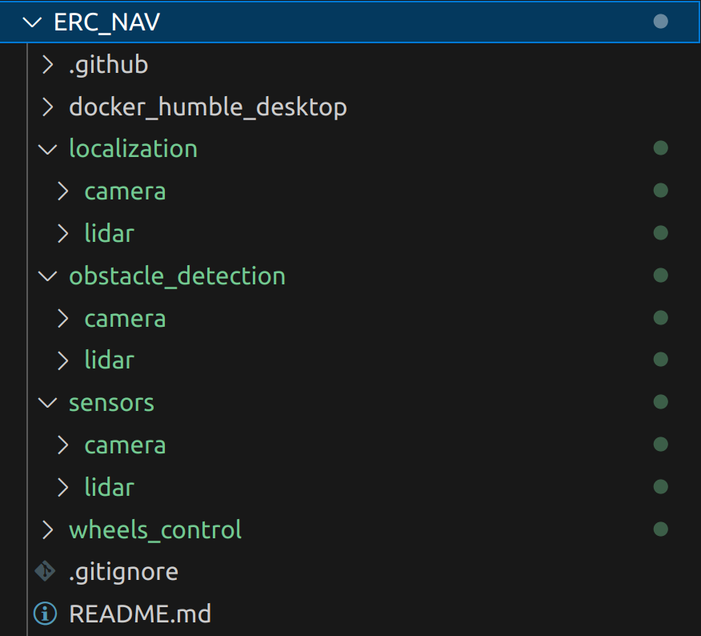

# NAV_workspace_2023

Warning: the code is not finish and have compilation error

## Organisation of the repository

The repository is organized as followed:

    

 

- The sensors directory contains the camera, lidar (ouster package) and imu packages that extract the data from the sensors and publish ROS2 topics of type: PointCloud2 for the lidar, Image and/or Pointcloud2 for the camera and IMU for the IMU. The imu package was created last year by the electronics team.
- The localization directory contains the code for the lidar (LIOSAM) and camera localization separately.
- The obstacle_detection directory contains the code for the lidar and camera obstacle detection separately.
- The path_planning directory contains the nav2 code that creates global and local costmaps and generates a path to the goal. A controller publishes velocity commands (type Twist) to follow the path.
- The wheels_control directory contains all the code for the manual and autonomous kinematics of the wheels and the control of the motors.

### Set/reset lidar connection

If lidar is connected to eth0

    sudo ip addr flush dev eth0
    sudo ip link set eth0 down
    sudo ip addr show dev eth0 # need to see ...state DOWN...
    sudo ip addr add 10.5.5.1/24 dev eth0
    sudo ip link set eth0 up
    sudo ip addr show eth0
    sudo dnsmasq -C /dev/null -kd -F 10.5.5.50,10.5.5.100 -i eth0 --bind-dynamic

If lidar is connected to eth1

    sudo ip addr flush dev eth1
    sudo ip link set eth1 down
    sudo ip addr show dev eth1 # need to see ...state DOWN...
    sudo ip addr add 10.5.5.1/24 dev eth1
    sudo ip link set eth1 up
    sudo ip addr show eth1
    sudo dnsmasq -C /dev/null -kd -F 10.5.5.50,10.5.5.100 -i eth1 --bind-dynamic

## Lidar stuff

### QUICK CHECK LIDAR WORKED

http://os-122140001125.local

######## LE DEBUT DE TOUTES CHOSES 2

### Usefull lidar commands

nmcli connection show
avahi-browse -arlt
ping 10.5.5.87
ping 10.5.5.1
pinglidar(ping os-122140001125.local)
nc os-122140001125.local

### LINUX usefull commands

usefull linux commands
sudo dmesg -w
usb-devices
lsusb

### ROS2

source /opt/ros/foxy/setup.bash
source install/setup.bash
colcon build --packages-select
ros2 daemon stop # to stop ros2 if strange behavior
ros2 daemon start # to start ros2

### lidar ipv4

sudo ip addr add 10.5.5.1/24 dev mtu 1500

## Motor Control

The motor control is implemented as a Lifecycle node (see [Lifecycle node ROS](https://www.notion.so/xplore-doc/Lifecycle-nodes-d6b64c8dcfd347eb90f44689c7f84d89?pvs=4)). To test it alone, you can use the following commands.

- `ros2 launch wheels_control wheels_control.launch.py` to launch the wheels control package
- `ros2 lifecycle set /NAV_motor_cmds configure` to start the motors
- `ros2 lifecycle set /NAV_motor_cmds cleanup` to stop the motors
